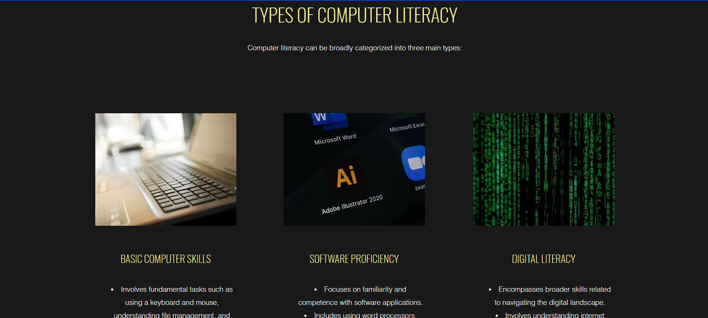
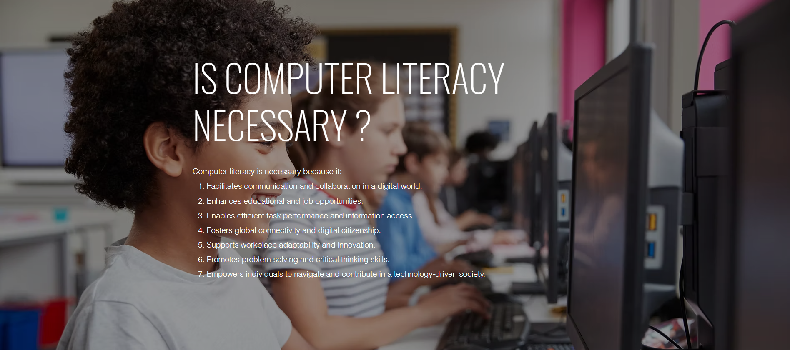
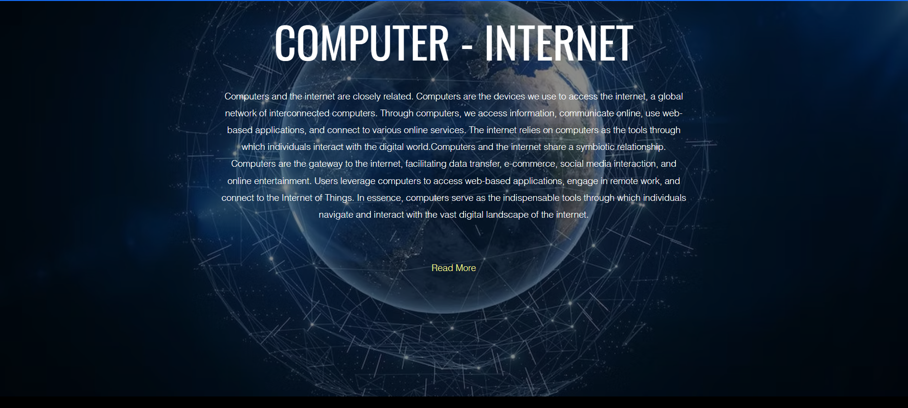
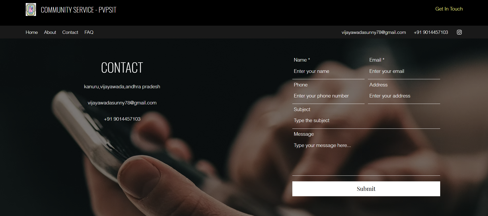

# AI Website on Computer Literacy

This is an AI-driven website designed to promote computer literacy, built using the Wix website builder. The website aims to provide visitors with knowledge about basic computer skills, digital tools, and the importance of technology in today's world.

## Website Features

- **Interactive and User-Friendly Interface**: Intuitive navigation and visually appealing design.
- **AI Integration**: Features powered by AI to enhance learning and engagement.
- **Resources**: Offers tutorials, tips, and guides on computer literacy.
- **Contact Form**: Users can get in touch for queries or additional learning resources.

## Website URL

The website is live and can be accessed at:  
[AI Website on Computer Literacy](https://vijayawadasunny78.wixsite.com/website)

## Screenshots

1. **Home Page**: A welcoming homepage with a brief overview of computer literacy and its significance.
2. **AI Features**: Showcase of AI tools and their integration into teaching computer skills.
3. **Resources Page**: A list of tutorials, articles, and guides to enhance computer literacy.
4. **Contact Page**: A form where visitors can submit inquiries or request additional help.

## How to Use

1. Visit the website at the above URL.
2. Explore the sections to learn about computer literacy.
3. Use the AI tools to enhance your understanding of digital technologies.
4. Contact the creator for further questions or collaboration.

## Technologies Used

- **Wix Website Builder**: For website creation and hosting.
- **Artificial Intelligence**: Integrated tools to provide dynamic and interactive features.

## Acknowledgments

Special thanks to the Wix platform for providing a robust and easy-to-use environment for website development.

## License

This project is licensed under the [MIT License](./LICENSE).

---

Feel free to explore and share your thoughts!
Output :
   
   
   
   
   
